# Redesign — PULSAR CENTRAL OPERACIONAL (Etapa 1.5)

Migração visual pura (nenhuma funcionalidade alterada) para o sistema de temas
claro/escuro com tokens únicos.

## Sistema de temas

- **Arquivo único de tema**: [`central/tema.css`](../central/tema.css) — todos os
  tokens dos dois temas (`:root` = claro padrão, `[data-theme="dark"]` = escuro)
  + componentes base (pill de status, badge de variação de KPI, toggle, fontes).
- **Regra absoluta cumprida**: nenhum componente usa hex direto. `index.html`,
  `central/central.css` e os estilos inline do `central/central.js` consomem só
  CSS variables (verificado por grep — restam apenas o favicon data-URI e os
  tokens do próprio tema).
- **Toggle**: botão sol/lua no rodapé da sidebar; preferência em
  `localStorage("pulsar_tema")`; script no `<head>` aplica o tema antes da
  primeira pintura (sem flash). No escuro, a logo em arquivo (preta) é trocada
  pelo wordmark do fallback (marca em accent + texto claro).

## Tokens principais

| Token | Claro | Escuro |
|---|---|---|
| `--bg` | `#F6F8FA` | `#0B0C0E` |
| `--surface` | `#FFFFFF` | `#15171A` |
| `--surface-2` | `#F0F3F6` | `#1D2024` |
| `--border` | `#E4E8EC` | `#26292E` |
| `--text` / `--text-2` | `#16181B` / `#6B7178` | `#F2F4F6` / `#9BA1A8` |
| `--accent` | `#29ABE2` (único protagonista) | idem |
| `--positive` | `#1F9D68` | `#43D69A` |
| `--negative` | `#D9435C` | `#FF7186` |
| `--warning` | `#A87A16` | `#F5C244` |
| Sombra | `0 1px 3px rgba(16,24,40,.06)` | nenhuma (elevação por borda/superfície) |

Semânticas ajustadas por tema para contraste AA sobre o fundo correspondente.

Tipografia: títulos e números de KPI em **Codec Pro** (fallback Space Grotesk),
corpo em **Inter**. KPIs 30px/700. Raio: 16px cards, 10px botões, 999px pills.

## Componentes padronizados (padrão da referência "Ponteo", paleta Pulsar)

1. **Card de KPI** (`.stat`): ícone de linha em chip arredondado no topo, número
   grande (Space Grotesk 700, 30px) com **badge de variação colado ao número**
   ("R$ 28,55 ↗ 68,2%"), label embaixo em `--text-2`.
2. **Pill de status** (`.ct-badge`): Ativo=positive, Pausado/Pendente=warning,
   Erro/Alerta=negative, Conectado=accent, Em breve/Exemplo=neutro. Radius 999px.
3. **Datebox** (`.ct-datebox`): caixa pill com ícone de calendário + intervalo
   de datas do período ativo, no topo direito da página do cliente, ao lado do
   grupo de pills 7d/14d/30d/Personalizado que controla a página inteira.
4. **Gráfico de barras** (`.ct-chart`, painel "Performance diaria"): barras pill
   com preenchimento listrado sutil; a barra ativa/hover em `--accent` sólido com
   **tooltip flutuante** (valor + data) e seta; **linha de média pontilhada** com
   rótulo; abas pill Investimento | Leads. Dados do endpoint `serie-diaria`
   (reais com cache 15 min; exemplo com aviso quando sem credencial).
5. **Listas como cards** (`.ct-lista`/`.ct-item` e `.alta-row`): linha-card com
   avatar/inicial à esquerda, título + subtítulo, valores e pills à direita —
   usadas em Pendências, "Radar: em alta agora" e na lista de clientes do Gestor.
6. **Barra de progresso com % embutido** (`.ct-progress`): componente criado
   agora; entra em uso no checklist de Tracking (Etapa 4).
7. **Tabelas** (campanhas): linhas 52px+, hover `--surface-2`, números à direita,
   valores fora da meta com badge negative, drill-down preservado.
8. **Sidebar**: item ativo com fundo `--accent-soft` + barra 3px accent, seções
   em caps pequenas, toggle no rodapé. **Colapsa para ícones entre 861–1100px**;
   drawer abaixo de 860px.
9. **Tabelas no mobile** (≤860px): cards empilhados com rótulo de coluna
   (`data-th` automático via `central.js`).

## Antes / Depois

Screenshots em [`docs/redesign/`](./redesign):

| Tela | Antes (claro antigo) | Depois claro | Depois escuro |
|---|---|---|---|
| Dashboard | 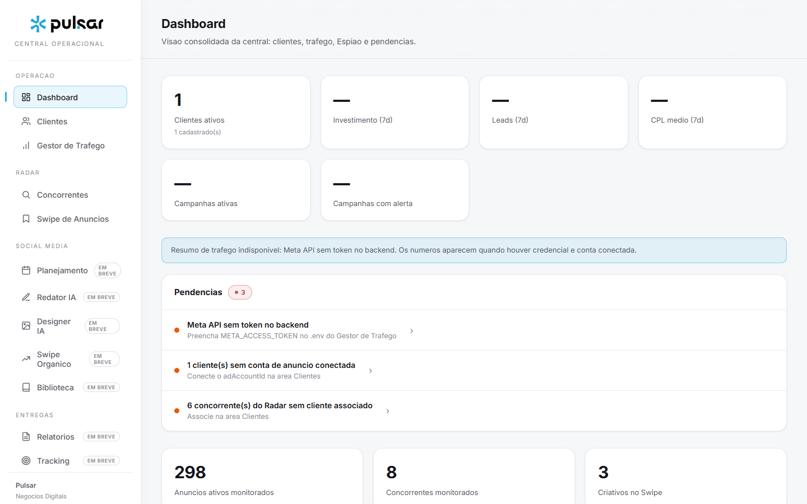 | 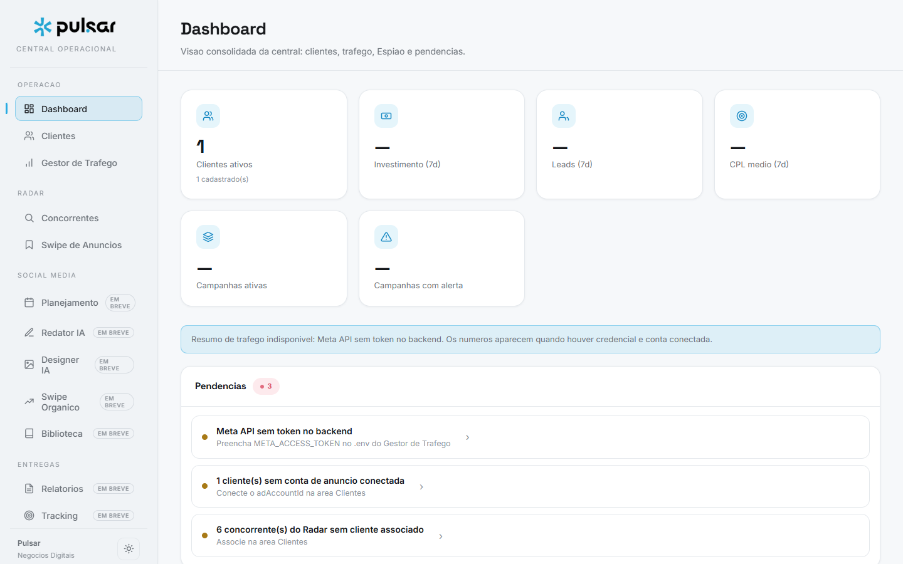 | 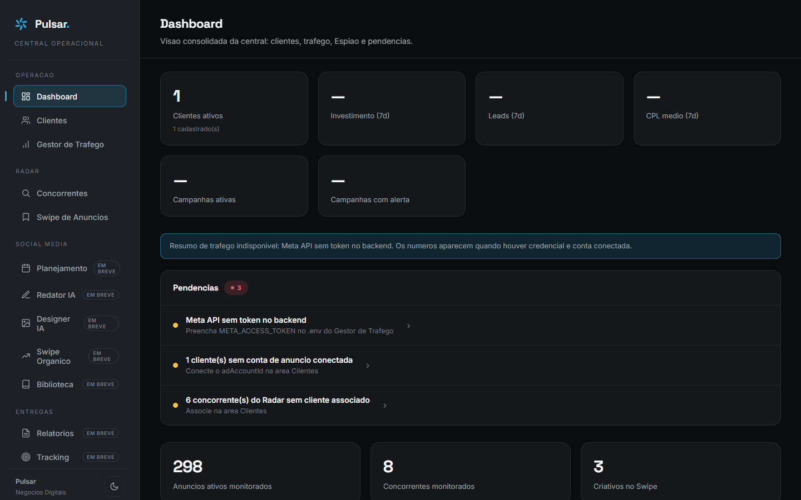 |
| Clientes | 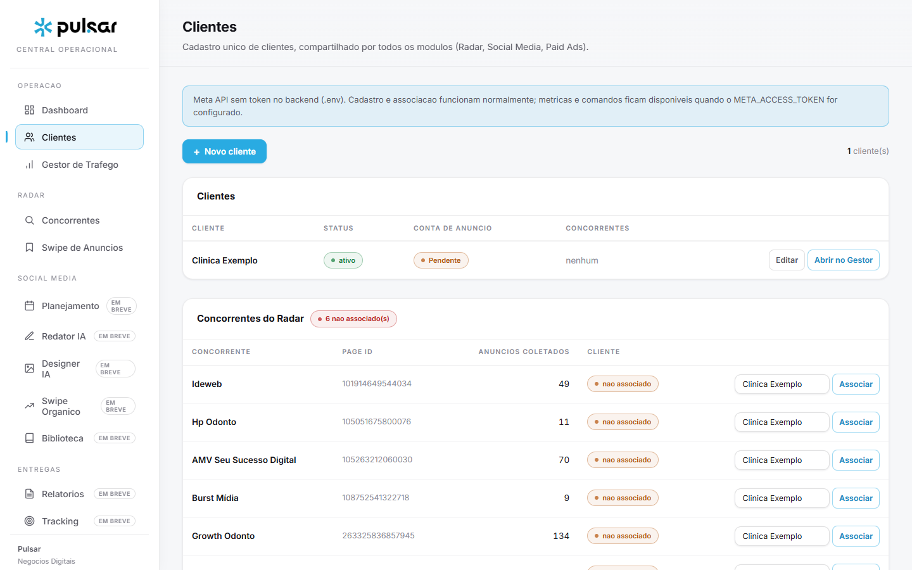 | 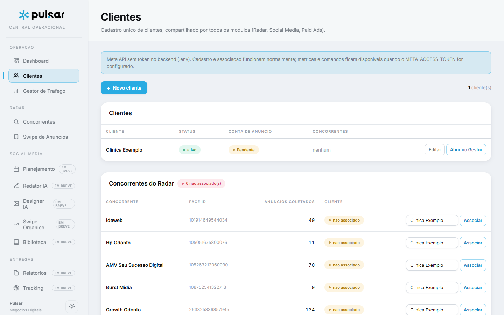 | 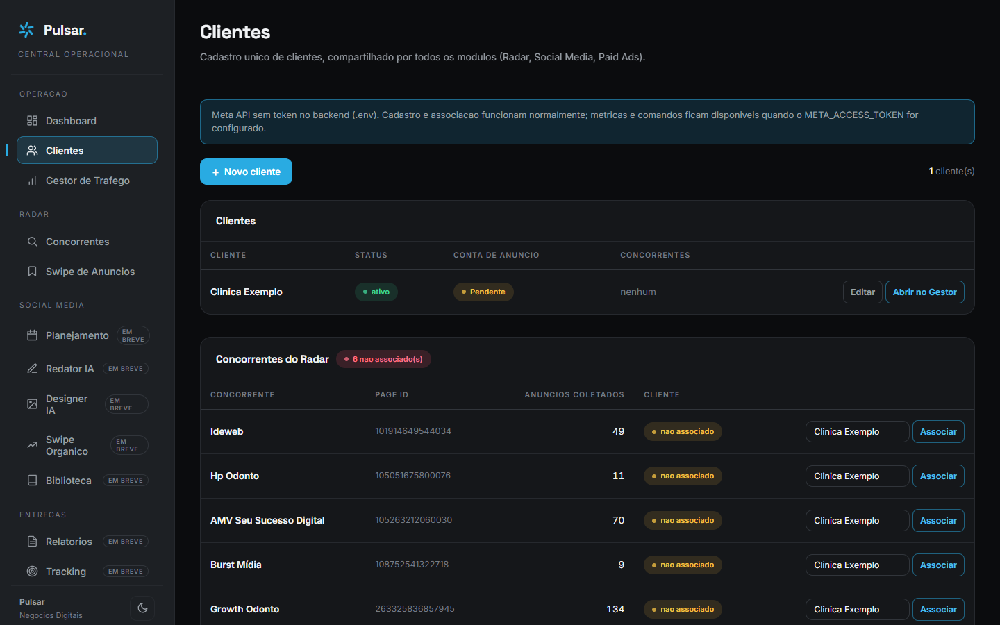 |
| Gestor (cliente) | 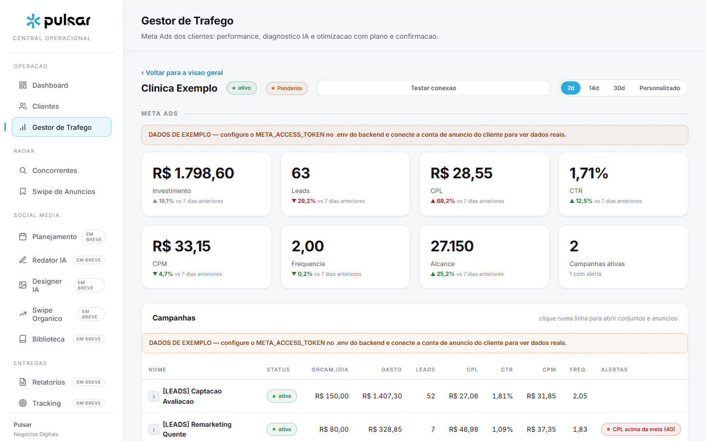 | 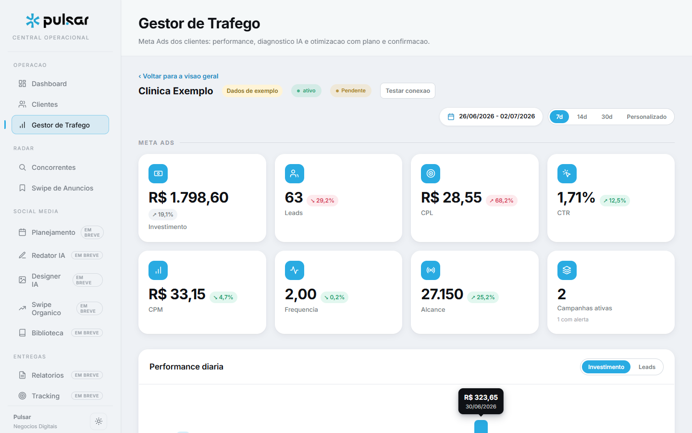 | 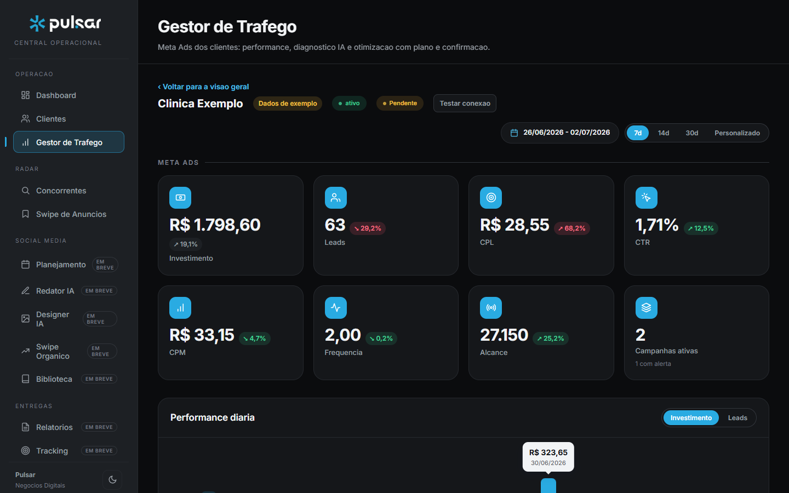 |
| Radar (Concorrentes) | 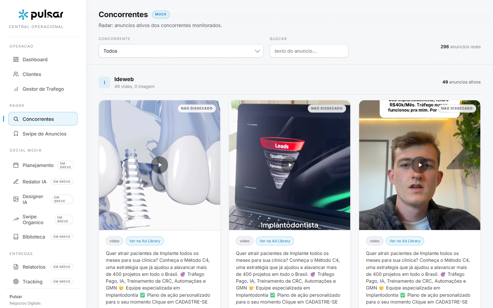 | 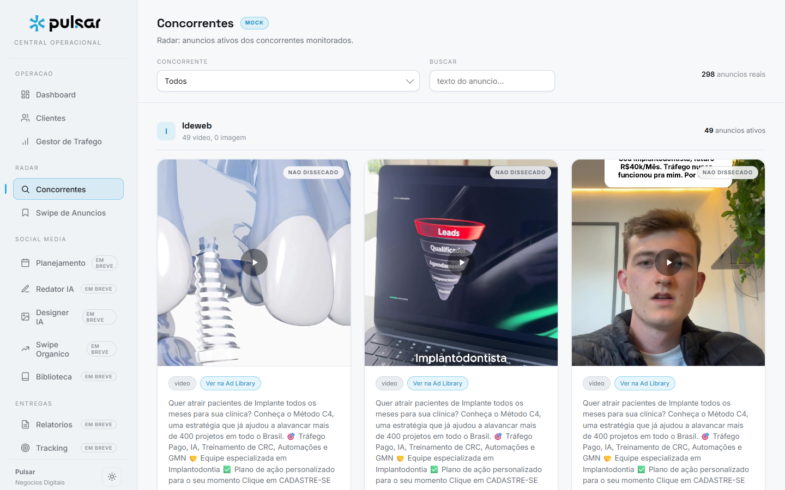 | 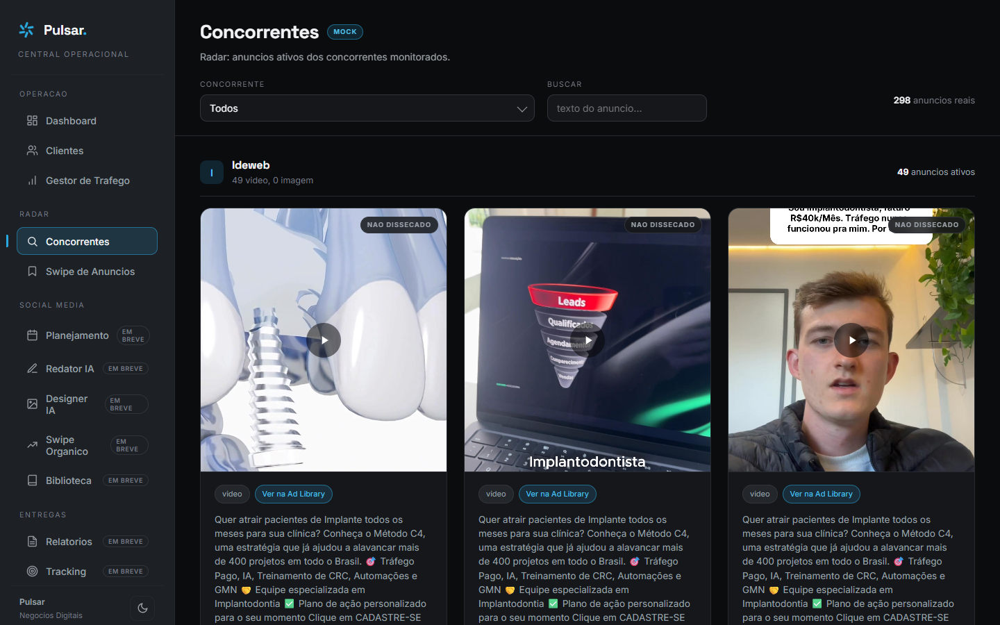 |
| Gráfico Performance diária | — (não existia) | 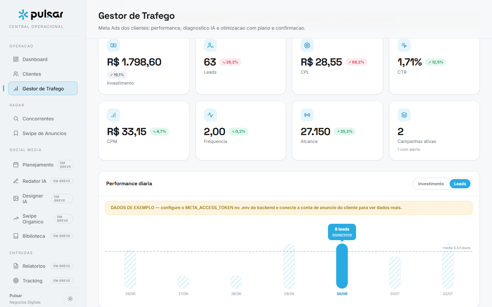 | (mesmo componente, tokens do escuro) |

As telas de Relatórios (Etapa 3) vivem dentro da página do cliente do Gestor e
foram migradas junto (aviso de exemplo, preview WhatsApp, link público e
histórico usam os mesmos tokens).

## Galeria final (replicação aprovada em todas as telas)

Conjunto `final-<tema>-<tela>.png` em [`docs/redesign/`](./redesign), nos dois
temas: `dashboard`, `clientes`, `gestor-geral`, `gestor-cliente`,
`gestor-relatorios`, `radar-concorrentes`, `radar-swipe`, `em-breve` e
`offline-gestor` (aviso de backend offline).

## Verificação

Checagem automatizada (Playwright): troca de tema aplica `--bg` correto nos dois
temas, preferência persiste após reload, zero erros de console navegando por
todas as áreas nos dois temas, sidebar 72px em 1000px de largura e tabela
empilhada com `data-th` em 480px.
